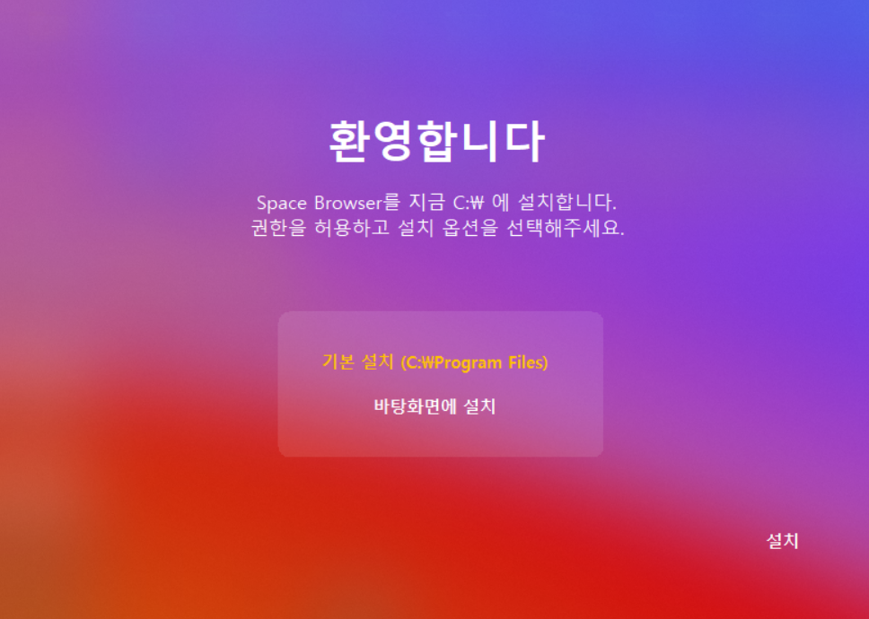

# SpaceBrowser
### Explore the Space.
-------------------
## Becon - SpaceBrowser Installer

- Notes :
  - ***Visual C++ and WindowsAPI and GDI+ must be installed.***
  - Only Windows 10~11 environment can be installed on C:\ drive.
  - When installation is complete, Becon window will close and Space Browser will open.
  - A shortcut to SpaceBrowser will be automatically created on the desktop.
  - No additional permissions are required other than basic Windows permissions.
  - If the shortcut is not created, run Becon.exe - right click - Run as administrator (A) and proceed with the installation.
  - If the installation did not proceed properly or you want to reinstall, right click on  
    BeconSetting.BECONDATA file - Open with Notepad And Press Ctrl + A, enter 0, press Ctrl + S to save,  
    And close the Notepad window. You can start the reinstallation.
  
- Functions :
  - Configure SpaceBrowser on C:\ drive.
  - Record whether BeconSetting.BECONDATA is installed.
  - This task requires read and write permissions.
  - Create a shortcut to SpaceBrowser on %s\Desktop (desktop). This operation requires file creation permission.
-------------------
  
## SpaceBrowser - Explore the Space.
- Notes :  
  - ***Visual C++ and WindowsAPI and GDI+ must be installed.***
  - Only supports Windows 10~11.
  - There is no automatic update function. It is recommended to load the new version from GitHub for weekly updates.
  - It was first released as 1.0.0 alpha version on August 31, 2024.
  - It is a one-man open source project, meet us on Discord or Reddit community.
  - Currently supported language is Korean (Ko-KR).

- Functions :
  - Load HTML5, CSS, JS and sub-languages ​​and browse websites.
  - Meet the Space4 search engine.

  
# The SpaceBrowser project is operated on a non-profit basis.
#### Copyright T: OpenTrix and direct rights U: Knuth Torvali.
#### Email: knuth.torvali@open.trix.org
